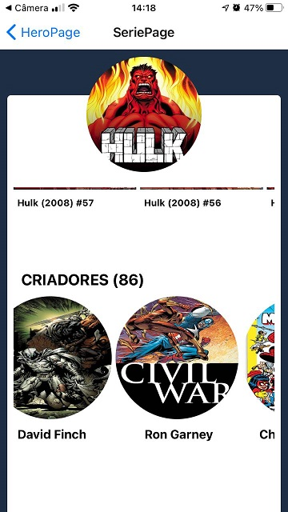
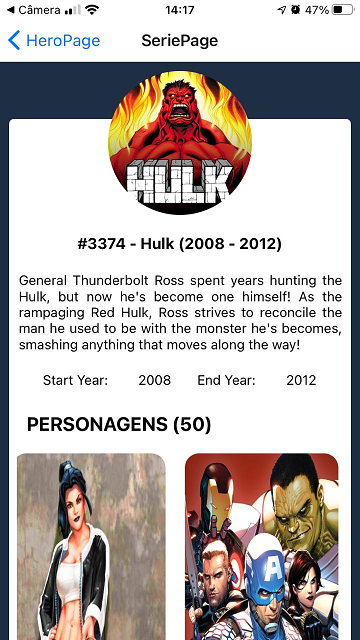
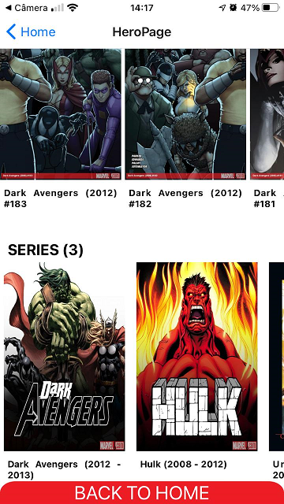
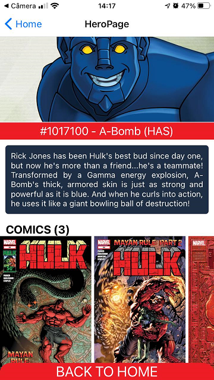
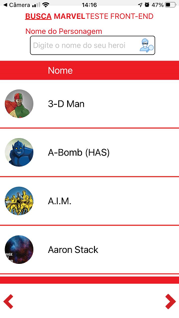

# Projeto FindHero
> Projeto criado em base de estudo de consumo de api da marvel. 
> https://developer.marvel.com/

#### Aplicativo feito com react native, expo, styled components, consumo de api

## Imagens do projeto

## Como usar:
1. Abra o projeto 
2. Use: "npm install" para baixar os node_modules
3. Depois use: "npm start" 
4. Vai abrir em: http://localhost:3000/
5. Ver o site em produção: https://clone-twitter-five.vercel.app/

## Conteudo desse estudo
* Html
* Css
* Typescript
* React sticky box
* Styled Components
* Styled Icons

